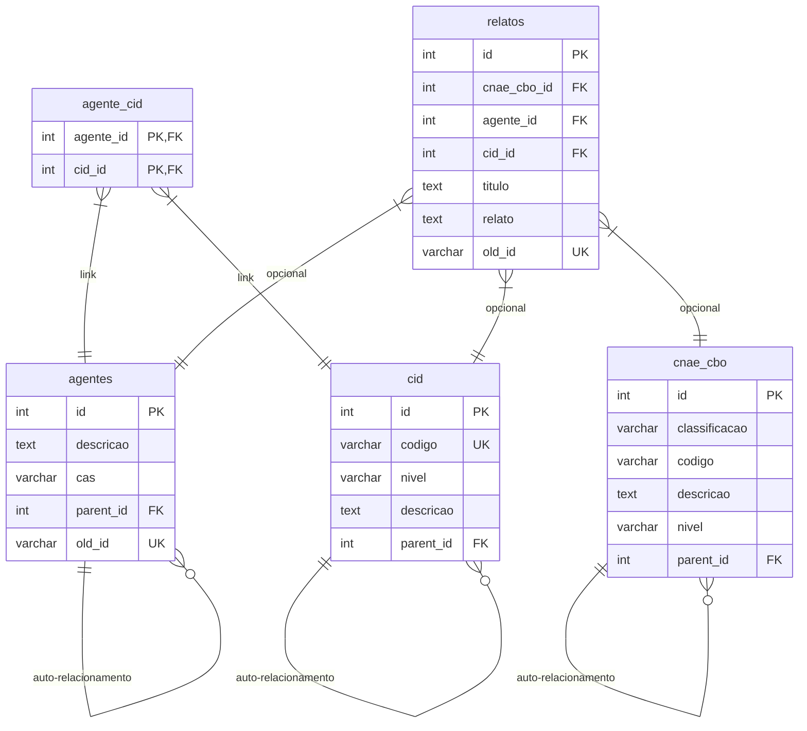

# LDRT - Lista de Doenças Relacionadas ao Trabalho

Este projeto consiste em uma aplicação web de consulta e preparação de banco de dados baseada na **Portaria GM/MS nº 1.999, de 27 de novembro de 2023**, que atualiza a **Lista de Doenças Relacionadas ao Trabalho (LDRT)** no Brasil. 

A aplicação foi desenvolvida em PHP (com Bootstrap 5 no front-end) e PostgreSQL, sendo otimizada tanto para uso por profissionais de saúde e segurança do trabalho quanto para atuar como fonte de **RAG (Retrieval-Augmented Generation)** em Agentes de Inteligência Artificial.

---

## 📖 Contexto e Portaria GM/MS 1.999/2023

A LDRT é o instrumento oficial do Ministério da Saúde que estabelece a relação entre doenças e a atividade laboral do trabalhador. Conforme a Portaria de Consolidação GM/MS nº 5, atualizada pela Portaria nº 1.999/2023, a lista é estruturada em duas partes principais:

1. **LISTA A (Agentes e Fatores de Risco)**: Classifica os agentes patogênicos de natureza ocupacional (Químicos, Físicos, Biológicos, Psicossociais e Outros) e aponta as doenças que podem ser decorrentes da exposição a eles.
2. **LISTA B (Doenças Relacionadas ao Trabalho)**: Organiza as patologias segundo o código CID-10 e lista quais agentes ou fatores de risco ocupacionais podem ser os causadores/desencadeadores.

---

## 🗄️ Estrutura do Banco de Dados

Para superar as ineficiências de chaves aleatórias em formato texto (strings hexadecimais), a base de dados foi normalizada e reestruturada utilizando chaves primárias numéricas auto-incrementais (`SERIAL`), o que garante alta performance em junções (`JOINs`) e indexação. 

As tabelas do banco de dados estão estruturadas da seguinte forma no esquema `ldrt`:



### Detalhes das Tabelas:
* **`cid`**: Cadastra a Classificação Internacional de Doenças (CID-10), suportando a estrutura hierárquica (Capítulo, Grupo, Categoria e Subcategoria) por meio do auto-relacionamento `parent_id`.
* **`cnae_cbo`**: Unifica as classificações de atividade econômica (CNAE) e ocupações brasileiras (CBO). O auto-relacionamento permite navegar na hierarquia (ex: CBO Grande Grupo -> Subgrupo -> Família -> Ocupação).
* **`agentes`**: Contém os agentes químicos, físicos, biológicos, psicossociais e ergonômicos da Lista A, mapeados a partir dos códigos hexadecimais originais (preservados em `old_id` para fins de auditoria e integração).
* **`agente_cid`**: Tabela de junção (muitos-para-muitos) que mapeia a relação direta da LDRT entre uma doença (CID) e o agente causal.
* **`relatos`**: Tabela preparada para armazenar relatos clínicos e de caso. Cada registro pode conectar um trabalhador de uma determinada ocupação (`cnae_cbo_id`), exposto a um agente (`agente_id`), com o diagnóstico resultante (`cid_id`).

---

## 🤖 Preparação para RAG e Agentes de IA

Para viabilizar o uso do banco de dados como base de conhecimento em sistemas de Inteligência Artificial Generativa (RAG), o banco conta com duas otimizações chave:

### 1. Busca Textual Nativa (Full-Text Search - FTS)
Foram criados índices do tipo **GIN** nas colunas textuais mais relevantes, configurados especificamente para a língua portuguesa. Isso permite buscas rápidas e semânticas baseadas em radicais de palavras (stemming):
* `idx_cid_search` (código + descrição)
* `idx_cnae_cbo_search` (código + descrição)
* `idx_agentes_search` (descrição)
* `idx_relatos_search` (título + relato)

### 2. View de Chunks Textuais (`v_rag_chunks`)
Uma view especializada que consolida todas as relações relacionais complexas em parágrafos narrativos contínuos de texto. Desse modo, o integrador ou script de ingestão do RAG não precisa fazer JOINS complexos: basta ler da view e gerar os embeddings para cada linha.

**Exemplo de Texto de Saída da View (Relação Agente-CID):**
> *"O agente de risco 'Chumbo e seus compostos tóxicos em atividades de trabalho' está associado à doença 'Outras anemias' (CID-10: D64)."*

**Exemplo de Texto de Saída da View (Relato de Caso):**
> *"Relato de Caso: 'Lorem ipsum dolor sit amet'. Ocupação/Atividade econômica: Reparação e manutenção de equipamentos eletroeletrônicos de uso pessoal (cnae: 9521500). Agente de risco associado: Benzeno. Diagnóstico associado: Lombalgia (CID-10: M510). Descrição do caso: [Texto completo do relato...]"*

---

## 🔌 API Endpoints

A aplicação fornece duas APIs em formato JSON:

### Autocomplete API (`/public/api/autocomplete.php`)
Usada para busca em tempo real (search-as-you-type) na interface.
* **Parâmetros**:
  * `type`: `cid`, `cnae`, `cbo` ou `agente` (obrigatório).
  * `q`: Termo de busca, mínimo de 2 caracteres (obrigatório).
* **Exemplo**: `/public/api/autocomplete.php?type=cid&q=M51`
* **Retorno**: Um array JSON contendo as opções correspondentes com `value` e `label`.

### RAG Search API (`/public/api/rag_search.php`)
Fornece buscas textuais rápidas nos chunks para agentes de IA.
* **Parâmetros**:
  * `q`: Termo de busca em português (opcional, ativa FTS).
  * `type`: Filtrar por tipo de chunk (`agente_cid` ou `relato`) (opcional).
  * `limit`: Quantidade máxima de resultados (padrão 50, máx 200).
* **Exemplo**: `/public/api/rag_search.php?q=ruído&type=agente_cid&limit=5`
* **Retorno**: Um objeto JSON contendo o status, número de resultados e um array com os registros detalhados incluindo o campo `chunk_text`.

---

## 🔒 Segurança

1. **Proteção do arquivo `.env`**: A pasta `/secrets/` está fora da raiz pública recomendada e contém um arquivo `.htaccess` com a diretiva `Deny from all`, garantindo que chaves de API e credenciais de banco de dados não possam ser baixadas ou acessadas publicamente via HTTP.
2. **Prevenção de Injeção de SQL**: Todas as queries e buscas nas APIs e na página inicial utilizam **PDO Prepared Statements** com vinculação explícita de parâmetros.

---

## 🚀 Como Executar e Validar Localmente

### Pré-requisitos
* PHP instalado (módulo `pdo_pgsql` ativo no `php.ini`).
* Python instalado (bibliotecas `pandas` e `openpyxl`).
* Banco de dados PostgreSQL configurado.

### Passos de Instalação e Execução
1. Configure o arquivo `/secrets/.env` com as credenciais do seu banco de dados PostgreSQL.
2. Para regenerar o arquivo SQL a partir da planilha Excel:
   ```bash
   python database/generate_sql.py
   ```
   *Isso criará o dump unificado em `database/schema_and_data.sql` realizando a reestruturação e mapeamento das chaves.*
3. Execute o script PHP do carregador para criar as tabelas e importar as mais de 20.000 linhas, executando as checagens automáticas de integridade referencial:
   ```bash
   php database/load_db.php
   ```
4. Suba o servidor local (XAMPP Apache apontando para a pasta `public/` ou via PHP integrado):
   ```bash
   php -S localhost:8000 -t public/
   ```
5. Acesse `http://localhost:8000` no navegador.
